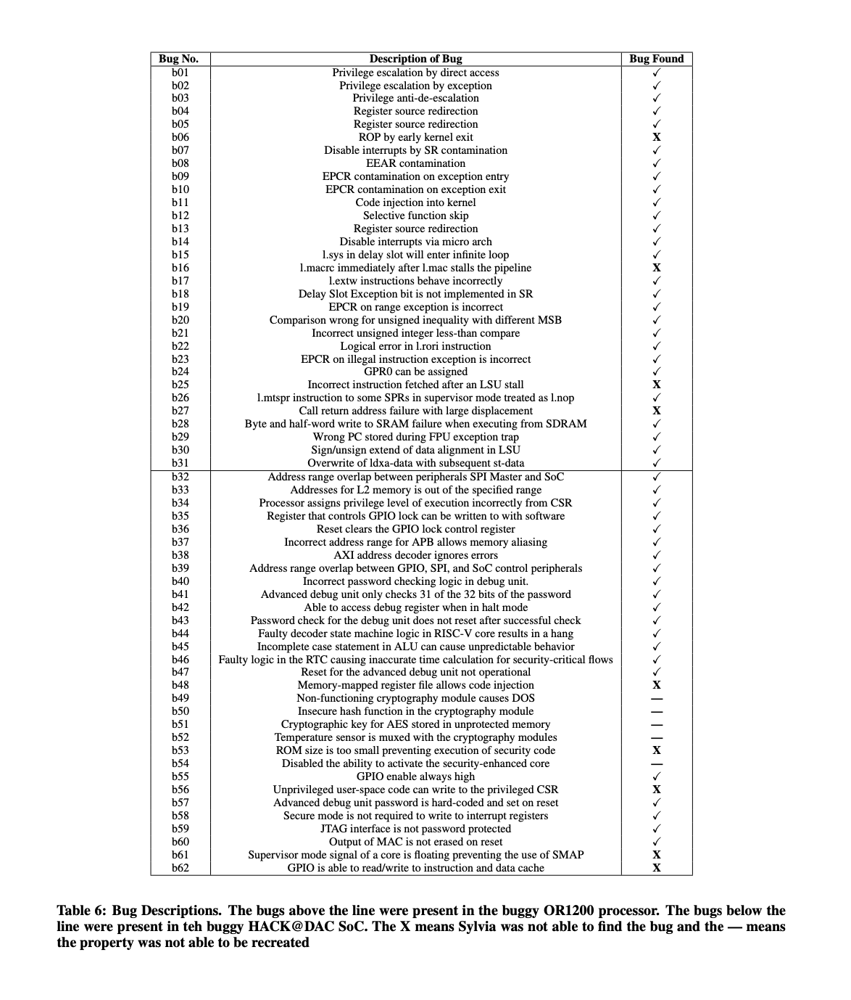

# Sylvia - A Software-Style Symbolic Execution Engine for Verilog
# The full table of bugs from the paper is below:

## Setup

Requirements
--------------------
- Python3: 3.8 or later
- z3: run `python3 -m pip install z3-solver`
- Icarus Verilog: 10.1 or later: run `sudo apt install iverilog`
- Jinja 2.10 or later: run `python3 -m pip install jinja2`
- PLY 3.4 or later: run `python3 -m pip install ply`
- Graphviz 2.38.0 or later: run `sudo apt install graphviz`
- Pygraphviz 1.3.1 or later: run `python3 - m pip install pygraphviz`. If you have trouble with this step with errors related to building wheel for pygraphviz, try running `sudo apt install graphviz-dev` and then rerunning the `python3 - m pip install pygraphviz` command.
- PyVerilog: run `python3 -m pip install pyverilog`

Download
--------------------
git clone https://github.com/kakiryan/Sylvia

cd Sylvia

Running Sylvia
---------------------
The following command should get you started with a basic run of symbolic execution:

`python3 -m main 1 designs/test-designs/updowncounter.v > out.txt`

The expected usage of Sylvia is:

python3 -m main {num_cycles} {list of verilog files}

`python3 -m main 1 designs/test-designs/test.v designs/test-designs/test_2.v  > out.txt` for example is a command 
with two example verilog files.

You can run:

`python3 -m main --help` for information about the different flags you can run Sylvia with. -B will display the initial & final symbolic store and path condition for each clock cycle during the run. 
